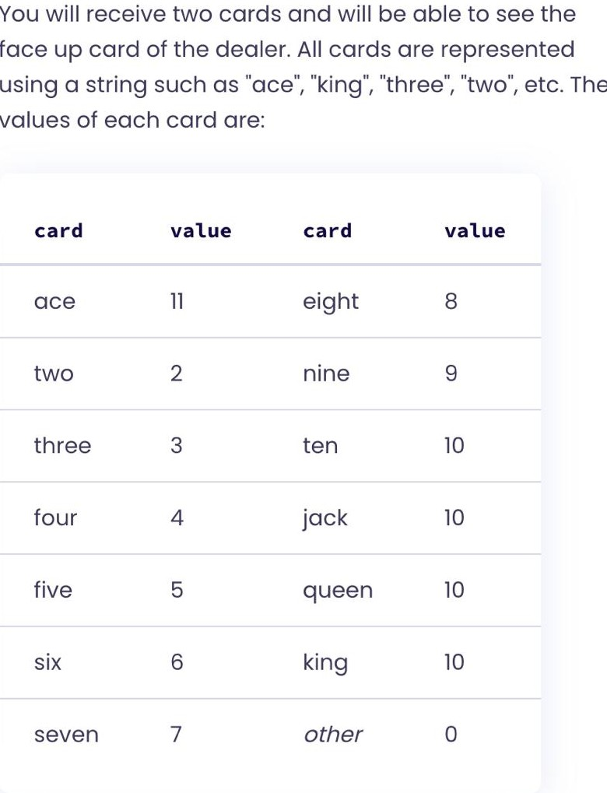

1) ## `divisor()` Instruction
    function that computes the greatest common divisor of two integers, using [Euclid’s algorithm](https://en.wikipedia.org/wiki/Euclidean_algorithm). 

2) ## `calculate_cost()` Instruction

    Each car normally costs $10,000 to produce individually, regardless of whether it is successful or not. But with a bit of planning, 10 cars can be produced together for $95,000.

    For example, 37 cars can be produced in the following way: 37 = 3 x groups of ten + 7 individual cars

    So the cost for 37 cars is: 3*95,000+7*10,000=355,000

    Implement the function CalculateCost that calculates the cost of producing a number of cars, regardless of whether they are successful.

3) ## `prime_factors()` Instruction
    Compute the prime factors of a given natural number.

    A prime number is only evenly divisible by itself and 1.

    Note that 1 is not a prime number.

    Example
    What are the prime factors of 60?

    Our first divisor is 2. 2 goes into 60, leaving 30.
    2 goes into 30, leaving 15.
    2 doesn't go cleanly into 15. So let's move on to our next divisor, 3.
    3 goes cleanly into 15, leaving 5.
    3 does not go cleanly into 5. The next possible factor is 4.
    4 does not go cleanly into 5. The next possible factor is 5.
    5 does go cleanly into 5.
    We're left only with 1, so now, we're done.
    Our successful divisors in that computation represent the list of prime factors of 60: 2, 2, 3, and 5.

4) ## `nth_prime()` Instruction

    Given a number n, determine what the nth prime is.

    By listing the first six prime numbers: 2, 3, 5, 7, 11, and 13, we can see that the 6th prime is 13.

    If your language provides methods in the standard library to deal with prime numbers, pretend they don't exist and implement them yourself.

    Remember that while people commonly count with 1-based indexing (i.e. "the 6th prime is 13"), many programming languages, including Rust, use 0-based indexing (i.e. primes[5] == 13). Use 0-based indexing for your implementation.

5) ## `Blackjack_game()` Instruction => TODO!
    

    Note: Commonly, aces can take the value of 1 or 11 but for simplicity we will assume that they can only take the value of 11.

    Depending on your two cards and the card of the dealer, there is a strategy for the first turn of the game, in which you have the following options:

    Stand (S)

    Hit (H)

    Split (P)

    Automatically win (W)

    Although not optimal yet, you will follow the strategy your friend Alex has been developing, which is as follows:

    - If you have a pair of aces you must always split them.
    - If you have a Blackjack (two cards that sum up to a value of 21), and the dealer does not have an ace, a figure or a ten then you automatically win. If the dealer does have any of those cards then you'll have to stand and wait for the reveal of the other card.
    - If your cards sum up to a value within the range [17, 20] you should always stand.
    - If your cards sum up to a value within the range [12, 16] you should always stand unless the dealer has a 7 or higher, in which case you should always hit.
    - If your cards sum up to 11 or lower you should always hit.

6) ## Beer song `verse()` and `sing()` Instruction
    Recite the lyrics to that beloved classic, that field-trip favorite: 99 Bottles of Beer on the Wall.

 example: 

    3 bottles of beer on the wall, 3 bottles of beer.
    Take one down and pass it around, 2 bottles of beer on the wall.

    2 bottles of beer on the wall, 2 bottles of beer.
    Take one down and pass it around, 1 bottle of beer on the wall.

    1 bottle of beer on the wall, 1 bottle of beer.
    Take it down and pass it around, no more bottles of beer on the wall.

    No more bottles of beer on the wall, no more bottles of beer.
    Go to the store and buy some more, 99 bottles of beer on the wall.

7) ## `reply()` Instruction
    Bob is a lackadaisical teenager. He likes to think that he's very cool. And he definitely doesn't get excited about things. That wouldn't be cool.

    When people talk to him, his responses are pretty limited.

    Instructions
    Your task is to determine what Bob will reply to someone when they say something to him or ask him a question.

    Bob only ever answers one of five things:

    - "Sure." This is his response if you ask him a question, such as "How are you?" The convention used for questions is that it ends with a question mark.
    - "Whoa, chill out!" This is his answer if you YELL AT HIM. The convention used for yelling is ALL CAPITAL LETTERS.
    - "Calm down, I know what I'm doing!" This is what he says if you yell a question at him.
    - "Fine. Be that way!" This is how he responds to silence. The convention used for silence is nothing, or various combinations of whitespace characters.
    - "Whatever." This is what he answers to anything else.

8)  ## Instructions  classic Frogger game => TODO!
    Manage a game player's High Score list.

    Your task is to build a high-score component of the classic Frogger game, one of the highest selling and most addictive games of all time, and a classic of the arcade era. Your task is to write methods that return the highest score from the list, the last added score and the three highest scores.